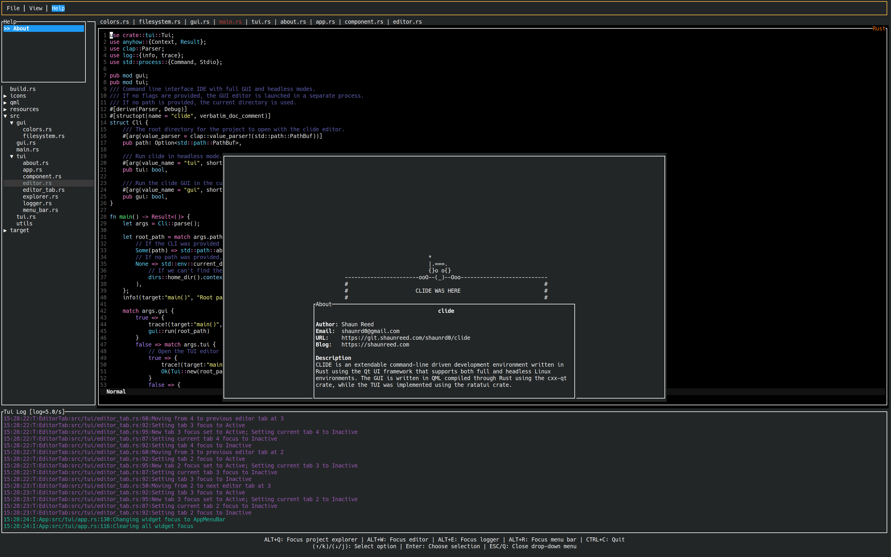
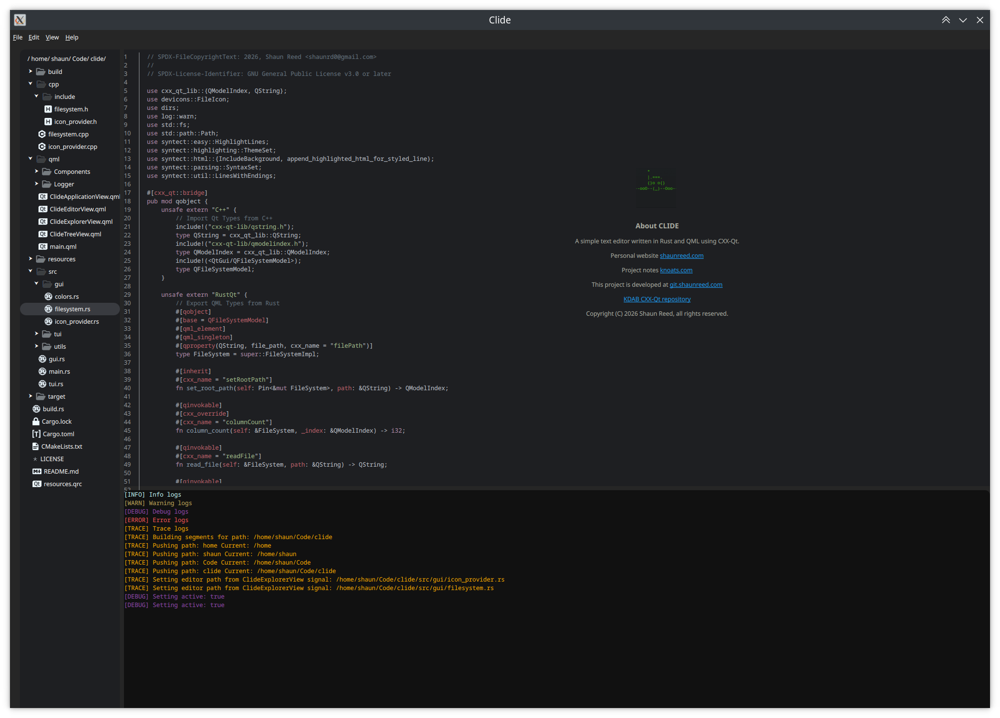

# CLIDE

[](https://git.shaunreed.com/shaunrd0/clide/workflows/build.yml)

CLIDE is an extendable command-line driven development environment written in Rust using the Qt UI framework that supports both full and headless Linux environments.
The GUI is written in QML compiled through Rust using the cxx-qt crate, while the TUI was implemented using the ratatui crate.

It's up to you to build your own development environment for your tools. Plugins are planned to be supported in the future for bringing your own language-specific tools or features.
Once you've created your plugin, you can submit a pull request to add a link to the git repository for your plugin to the final section in this README if you'd like to contribute.

The following packages must be installed before the application will build.
In the future, we may provide a minimal installation option that only includes dependencies for the headless TUI.

```bash
sudo apt install qt6-base-dev qt6-declarative-dev qt6-tools-dev qml6-module-qtquick-controls qml6-module-qtquick-layouts qml6-module-qtquick-window qml6-module-qtqml-workerscript qml6-module-qtquick-templates qml6-module-qtquick qml6-module-qtquick-dialogs qt6-svg-dev
```

And of course, [Rust](https://www.rust-lang.org/tools/install).

```bash
curl --proto '=https' --tlsv1.2 -sSf https://sh.rustup.rs | sh
```

This project requires at least Qt 6.7.3 To check your Qt version

```bash
qmake6 -query QT_VERSION
```

Use the [Qt Installer](https://www.qt.io/development/download) to download and install the Qt version of your choice.
If the installer is run with `sudo`, the default install location is `/opt/Qt`, otherwise Qt will be installed into your home directory.

**You must set the QMAKE variable before building clide**. This should be a path to `qmake6` binary installed on your system.
The following export is the default installation path for Qt 6.7 on Ubuntu 24.04

```bash
export QMAKE=$HOME/Qt/6.7.3/gcc_64/bin/qmake6
export LD_LIBRARY_PATH=$HOME/Qt/6.7.3/gcc_64/lib
```

Though environment variables set using `export` will take precedence, these can also be set in [.cargo/config.toml](./.cargo/config.toml) for conveinence

```toml
[env]
QMAKE="/opt/Qt/6.7.3/gcc_64/bin/qmake6"
LD_LIBRARY_PATH="/opt/Qt/6.7.3/gcc_64/lib"
```

## Usage 

To install and run clide

```bash
git clone https://git.shaunreed.com/shaunrd0/clide
cd clide
cargo install --path .
```

After installation `clide` can be used directly.
A path can optionally be provided to open a specific directory with `clide /path/to/project`.

```bash
clide --help

Extendable command-line driven development environment written in Rust using the Qt UI framework.
If no flags are provided, the GUI editor is launched in a separate process.
If no path is provided, the current directory is used.

Usage: clide [OPTIONS] [PATH]

Arguments:
  [PATH]  The root directory for the project to open with the clide editor

Options:
  -t, --tui   Run clide in headless mode
  -g, --gui   Run the clide GUI in the current process, blocking the terminal and showing all output streams
  -h, --help  Print help
```

### TUI

The TUI is implemented using the ratatui crate and has the typical features you would expect from a text editor.
You can browse your project tree, open / close new editor tabs, and save / reload files.
Controls for the TUI are listed at the bottom of the window, and update depending on which widget you have focused.
For now, there are no language-specific features or plugins available for the TUI – it is only a text editor.

To run the TUI, pass the `-t` or `--tui` flags.

```bash
# With cargo from the project root
cargo run -- -t
# Or via clide directly after installation
clide -t
```



### GUI

The GUI is still in development. It is at this point a text viewer, instead of a text editor.
There are many placeholder buttons and features in the GUI that do nothing when used.

The GUI is run by default when executing the `clide` application.

```bash
# With cargo from the project root
cargo run
# Or via clide directly after installation
clide
```



## Development

It's recommended to use RustRover or Qt Creator for development.

The [Qt Installer](https://www.qt.io/download-qt-installer) will provide the latest Qt6 LTS and Qt Creator.
If using RustRover be sure to set your QML binaries path in the settings menu.
If Qt was installed to its default directory this will be `$HOME/Qt/6.8.3/gcc_64/bin/`.

Viewing documentation in the web browser is possible, but using Qt Assistant is recommended. 
It comes with Qt6 when installed. Run the following command to start it.

```bash
nohup $HOME/Qt/6.8.3/gcc_64/bin/assistant > /dev/null 2>&1 &
```

If you are looking for an include path from Qt

```bash
find /usr/include/x86_64-linux-gnu/qt6/ -name QFile*

/usr/include/x86_64-linux-gnu/qt6/QtWidgets/QFileIconProvider
/usr/include/x86_64-linux-gnu/qt6/QtWidgets/QFileDialog
/usr/include/x86_64-linux-gnu/qt6/QtGui/QFileSystemModel
/usr/include/x86_64-linux-gnu/qt6/QtGui/QFileOpenEvent
/usr/include/x86_64-linux-gnu/qt6/QtCore/QFile
/usr/include/x86_64-linux-gnu/qt6/QtCore/QFileDevice
/usr/include/x86_64-linux-gnu/qt6/QtCore/QFileSystemWatcher
/usr/include/x86_64-linux-gnu/qt6/QtCore/QFileInfoList
/usr/include/x86_64-linux-gnu/qt6/QtCore/QFileInfo
/usr/include/x86_64-linux-gnu/qt6/QtCore/QFileSelector
```

This helped find that QFileSystemModel is in QtGui and not QtCore.

### Resources

Some helpful links for reading up on QML if you're just getting started.

* [Rust Crates - cxx-qt](https://docs.rs/releases/search?query=cxx_qt)
* [QML Reference](https://doc.qt.io/qt-6/qmlreference.html)
* [QML Coding Conventions](https://doc.qt.io/qt-6/qml-codingconventions.html)
* [All QML Controls Types](https://doc.qt.io/qt-6/qtquick-controls-qmlmodule.html)
* [KDAB CXX-Qt Book](https://kdab.github.io/cxx-qt/book/)
* [github.com/KDAB/cxx-qt](https://github.com/KDAB/cxx-qt)
* [QML and C++ Intergration](https://doc.qt.io/qt-6/qtqml-cppintegration-overview.html)


### Plugins

TODO: Add a list of plugins here. The first example will be C++ with CMake functionality.
